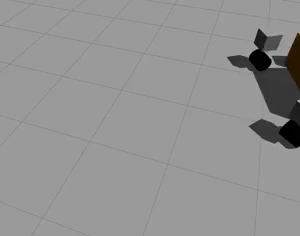
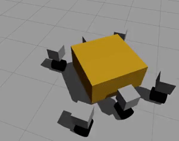
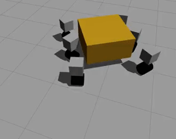

# Rover Locomotion

This repository contains software, based on the ROS framework, for universal locomotion of a wheeled rover such as [ExoMars rover](https://en.wikipedia.org/wiki/ExoMars_(rover) where every wheel can be steered. It uses the [Ackermann steering geometry](https://en.wikipedia.org/wiki/Ackermann_steering_geometry) and sets the drive joint velocities according to the position of the wheels and the radius as defined in the [URDF](http://wiki.ros.org/urdf) file.

The steering joints are limited to `[-90; +90]` degrees to represent realistic revolute steering mechanism (contrary to continous joints).

The number of wheels is not limited, the naming convention of controllers and joints in the URDF file and configuration file must be followed, an example is provided.

It is assumed that all the wheels can be steered (not a requirement), an extra feature is that the front/back turning point offset can be modified with a parameter.

Ideally the wheel radius would be defined only once, however there is currently no elegant way to read a parameter from a URDF/xacro file, thus the same wheel radius must also be defined in the configuration file.

A dummy six-wheeled rover URDF and launch file are provided for simulation in Gazebo.

<table>
    <tr>
        <th>Ackermann steering</th>
        <th>Point-turn</th>
        <th>Offset turn</th>
    </tr>
    <tr>
        <td></td>
        <td></td>
        <td></td>
    </tr>
</table>

**Keywords**: rover, locomotion, Ackermann, point-turn, simulation.

## License

The work in this repository is licensed under [MIT license](LICENSE).

**Author(s): Karl Kangur  
Maintainer: Karl Kangur, karl.kangur@gmail.com  
Affiliation: private**

The *rover_locomotion* package has been tested under ROS Kinetic and Ubuntu 16.04.

## Installation

### Building from Source

#### Dependencies

* Robot Operating System (ROS)
* Gazebo

#### Building

To build from source, clone the latest version from this repository into your catkin workspace and compile the package using

    cd catkin_ws/src
    git clone https://github.com/kprobotics/rover_locomotion.git
    cd ../
    catkin build rover_locomotion

### Unit Tests

Run the unit tests with

    catkin build rover_locomotion --no-deps --verbose --catkin-make-args run_tests

## Usage

This package requires a well defined URDF/xacro of the mobile platform with joints, transmissions and controllers named appropriately:

* The root link of the platform shall be named `base_link`
* Steering joints shall be named `joint_steer_xxx`
* Driving joints shall be named `joint_drive_xxx`
* Steering controllers shall be named `joint_steer_xxx_position_controller`
* Driving controllers shall be named `joint_drive_xxx_velocity_controller`

Run the main node with

    rosrun rover_locomotion rover_locomotion.py

## Config files

The platform configuration file defines the wheel radius and all the joint controller constants (PID controllers). An example can be found under `config/rover_dummy.yaml`. The same naming convention applies to the controller names as above.

## Launch files

* **rover_locomotion.launch:** launches a simulation in Gazebo and the rover locomotion node with its configuration. To see the rover move send `Twist` topics to `cmd_vel` with [`teleop_twist_keyboard`](http://wiki.ros.org/teleop_twist_keyboard) for example.
  * `rover_name`: defines the name of the rover. Default: `rover_dummy`
  * `rover_xacro`: defines the path to the xacro file of the rover. Default: `rover_dummy.xacro`
  * `rover_parameters`: defines the path to the YAML configuration file specific to the rover. Default: `rover_dummy.yaml`
  * `sim_paused`: start the simulation in paused mode. Default: `true`
  * `sim_use_sim_time`: use the simulation time. Default: `true`
  * `sim_gui`: show the simulation user interface. Default: `true`
  * `sim_headless`: run the simulation headless. Default: `false`
  * `sim_debug`: run the simulation in debug mode. Default: `false`

## Nodes

### rover_locomotion

Controls the steering angles and wheels speeds of a mobile platform where every wheel is similar and can be steered.

#### Subscribed Topics

* `cmd_vel` ([geometry_msgs/Twist](http://docs.ros.org/api/geometry_msgs/html/msg/Twist.html))

    The set point speed of the platform. Only the `x` component of the linear vector and `z` component of the angular vector are used. The topic name can be modified with the `command_name` parameter.

#### Published Topics

* `controllers/[joint_name]/command` ([std_msgs/Float64](http://docs.ros.org/api/std_msgs/html/msg/Float64.html))

    Joint commands, one topic per controlled joint.

#### Parameters

* `command_name` (string, default: `/cmd_vel`)

    Topic name of the `Twist` velocity message.

* `controllers` (array)

    Controllers for all the steering and driving joints, must be named according to the naming convention above.

* `wheel_radius` (float)

    Wheel radius in meters, required to evaluate the wheel speeds, must be the same as in the URDF/xacro file.

* `turn_offset_x` (float, default: `0`)

    Front/back offset of the turning point relative to the origin of the `base_link`, in meters. Changing this parameter will have an effect during runtime, speed command must be sent again though.
